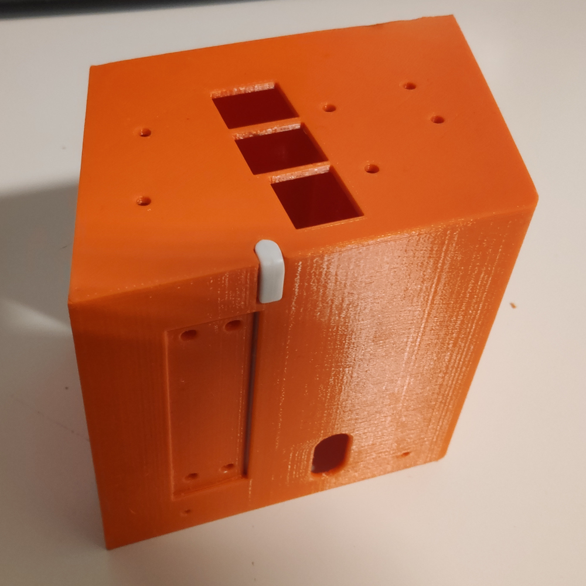
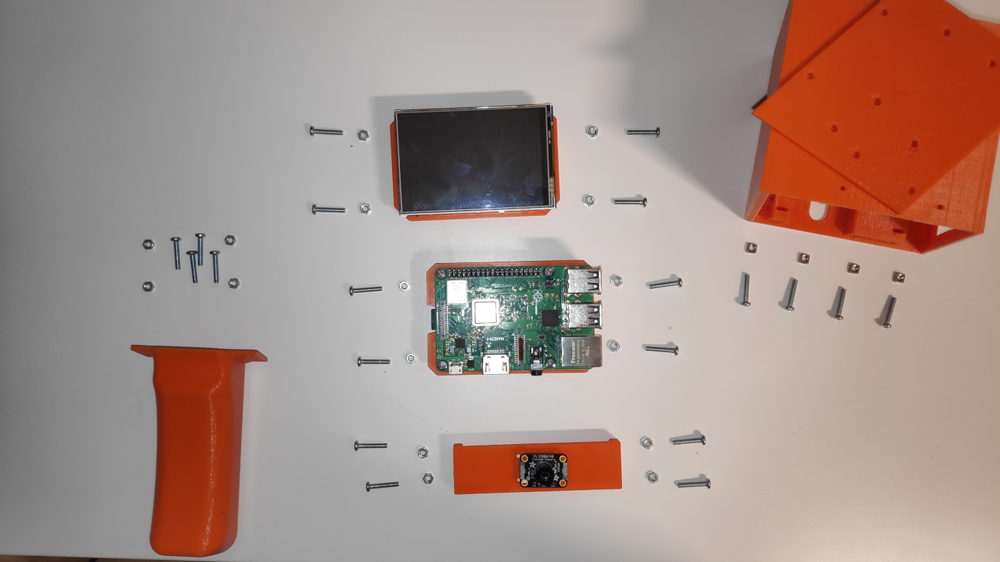
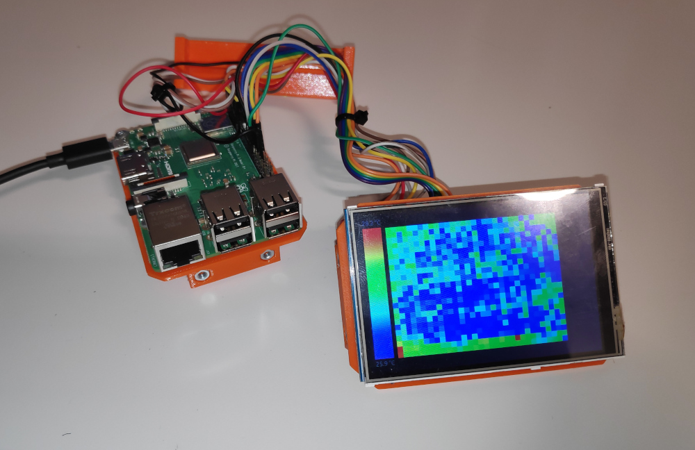
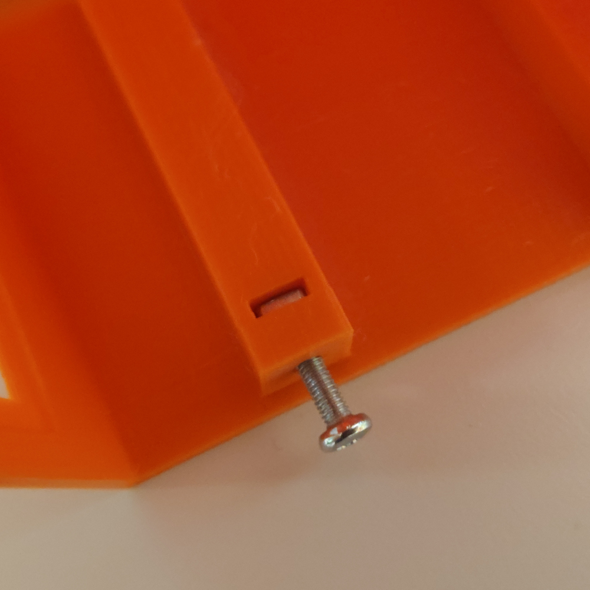
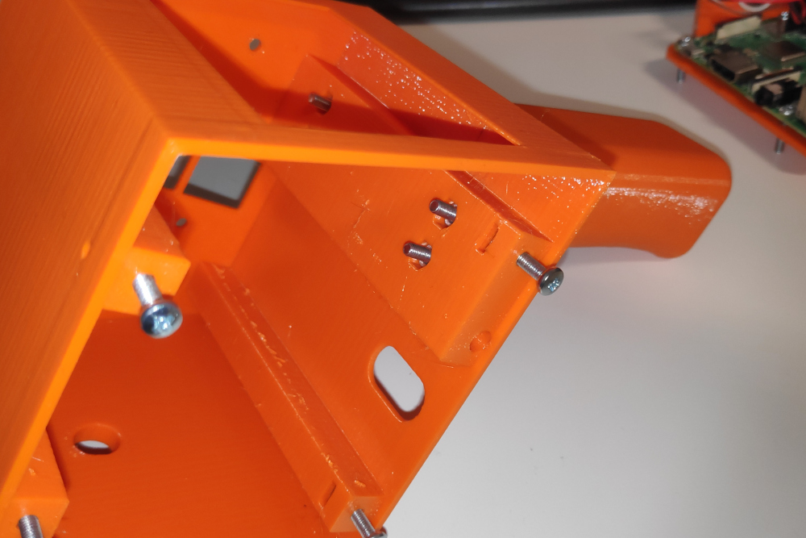
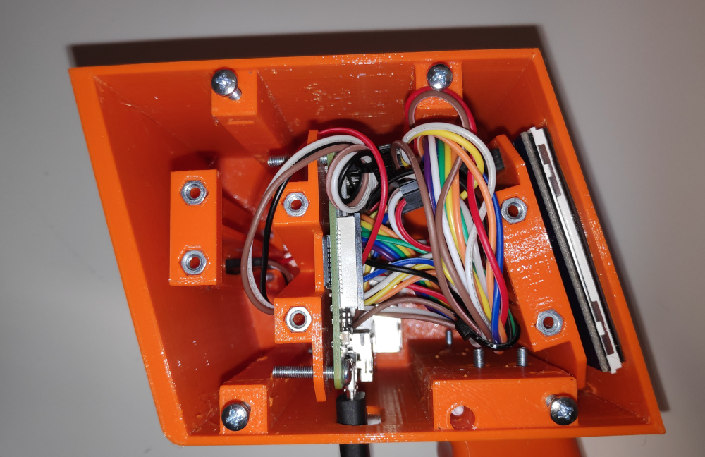
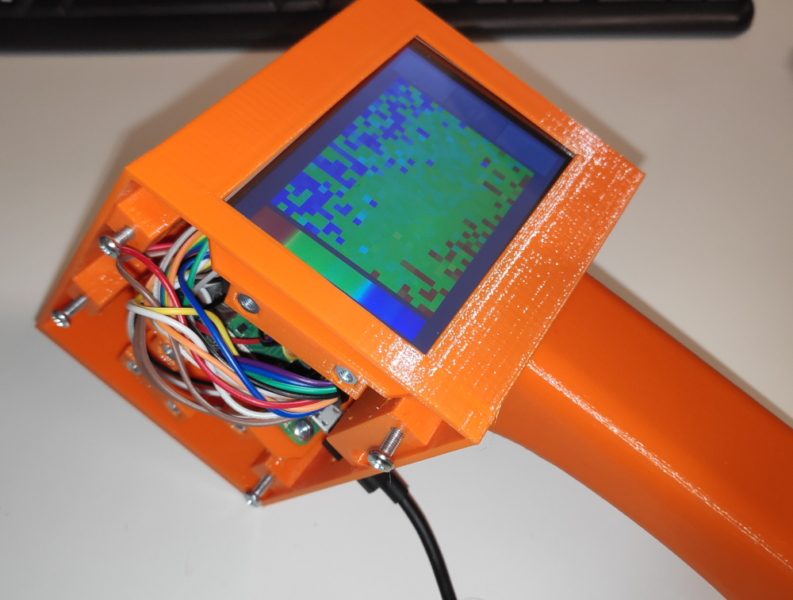
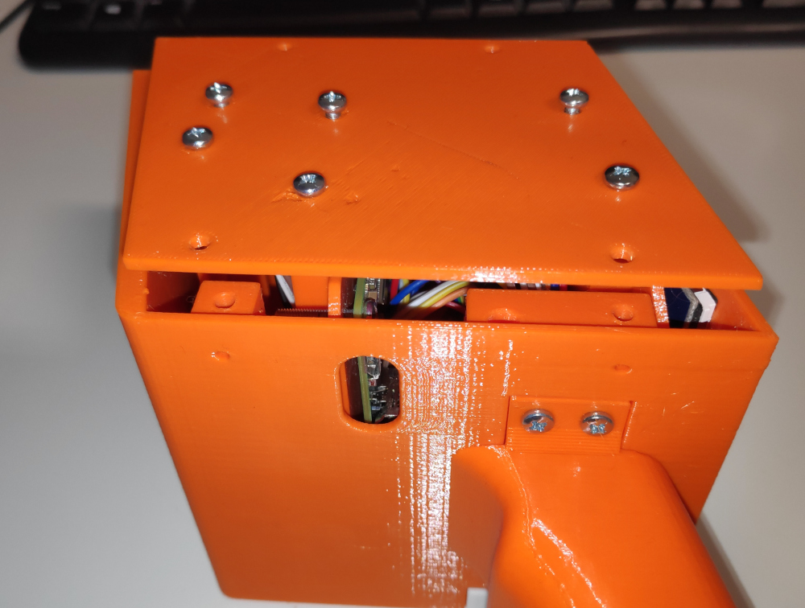
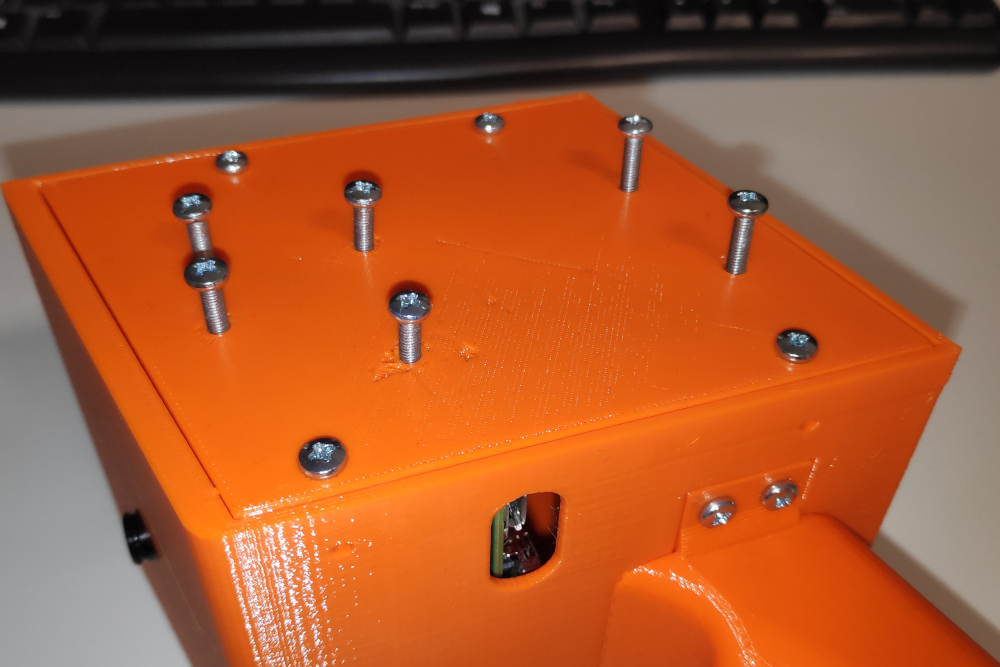

# Thermal Camera

A project for the Raspberry Pi, where a thermal camera is connected to the Raspi, which save or display pictures on a screen.

## Build guide

### Requirements

Before starting the build, let's first talk about what is required for building a ThermalCamera.

- A 3D-Printer (Optional, 3D-prints can be ordered online, but it's rather expensive, not recommended)
- About 150€ [TODO: Verify price] for electrical components
- Some jumper cables, 16 female-male and 4 female-female
- 24 M3 Bolts, 16 hex nuts and 4 square nuts
- A soldering kit

### Preparation

#### Ordering components

The ThermalCamera system consists of three components: The IR sensor, a processing unit, and a touchscreen display. With the 150€, order these components:

- [MLX90640](https://www.berrybase.de/adafruit-mlx90640-ir-waermebildkamera-breakout)
- [Raspberry Pi 3 B](https://www.berrybase.de/detail/index/sArticle/3924?src=raspberrypi)
- [3.5" Berrybase Display](https://www.berrybase.de/3-5-display-fuer-raspberry-pi-mit-resistivem-touchscreen)

While waiting for the components to arrive, start to print all parts for the case.

#### 3D-Printing the case

I recommend to use a more strong filament type, like PETG or ABS/ASA. The case used by this guide is made of orange PETG.

Under the folder CAD_CaseV2/Export you'll find a bunch of .stl and .3mf files. The .3mf are project files from Prusa Slicer, and can be ignored if you don't have the exact same printer and exact same settings as the file dictates.

The .stl files are the files you'll need, except for the Tripod_Connector.stl, which is optional. Start with printing the supports first, as you'll need them right away when continuing with the components.

If the supports are done and your components have arrived, you can go on with wiring while the rest of the case is still printing.

If the case is done, make sure to test if the pen holder on the right bottom side is good. The Berrybase display comes with a stylus, which can be put into the pen holder. If you need to use a lot of force, it means that 3D-printing artifacts like strings and blobs have clogged the hole a little, and need to be removed by scraping along the inner walls a bit. Once the stylus fits easily into the pen holder, the case is good to go!

Another feature of the case is the interface at the bottom. Normally you'd screw the handgrip on for a nice way of holding the case, but anything can be screwed onto it. An example is the tripod connector: This is an adapter which makes it able to put the ThermalCamera onto a tripod, so you can statically record a specific location for a longer period of time.

Here's an image with all prints, components, bolts and nuts laid out (Note: Raspberry Pi already screwed on its support)

### Supports and wiring

If all the electrical components have arrived and all three supports have been printed, you can go on with this section.

Before you can do anything else, the MLX module needs to be prepared for wiring. If you haven't noticed it yet, it comes in two parts: the main module, and a pin header. If you are using jumper wires, you need to solder the pin header onto the MLX module. Make sure to put the pins on the bottom side, on the opposite side of the sensor cylinder.

Now put all components on the dedicated supports. The Raspberry Pi must be screwed onto the support, and the MLX module can be screwed on, but it's not mandatory. The display has no way of being fixed to the support.

Important note: when pointing the MLX module sideways, **the edge with the pin header marks the bottom side**. Later when putting the support into the case, make sure to put it in the right way.

With the components on their supports, go on with the wiring. Start with the MLX module.

#### MLX wiring

The MLX module is connected to Raspberry Pi GPIO in the following fashion:

- [Camera Pin] > [Raspi Pin]
- VIN > 5V (Pin 2)
- GND > GND (Any GND Pin equal or above Pin 30)
- SCL > I2C SCL (Pin 3)
- SDA > I2C SDA (Pin 2)

#### Display wiring

Since some pins are used by the MLX, we cannot put the display directly on the Raspberry Pi, we have to manually connect the pins with jumper wires.

Also, the display, by documentation, occupies every power pin on the raspi. This is a problem since the MLX needs one power pin for itself. I have discovered that keeping **Pin 2 disconnected** won't affect the display. That way we have a free power pin for the MLX.

Use [this guide](https://www.waveshare.com/wiki/3.5inch_RPi_LCD_(A)#Interface_Definition) to connect all other pins using jumper wires.

### Raspberry Pi image configuration

Now it's time to install the software on the Raspberry Pi. Install **Raspbian OS x32 lite** onto an sd card, it's important to use the lite version, the installation script later will install all necassary compontents. If you're using the pi-imager tool, you can optionally configure additional things like a different hostname and such. These things are recommended to configure:

- Set hostname to thermal-camera
- Create user "pi" with some password
- Enable ssh

Next step is to somehow get control of the Raspberry Pi terminal. It doesn't matter if it's over ssh, or using hdmi and a keyboard.

- Connect the Raspberry Pi to the internet
- Copy the contents of scripts/raspi onto the pi
- Make run.sh executable, and execute
- You will be prompted to input a password for a new user; input a new password for that user

That new user is the one running the ThermalCamera software, and has no privileges besides running that software. The default name of that user is "thermal-camera". The system logs in as that user at startup.

The initial user "pi" is used for administrative purposes, like installing packages, or configuring the system. This user has sudo priviliges. Whenever connecting via ssh, that user should be logged in as.

The script will take a while to finish, an hour or so can be expected. At the end the Raspberry Pi will restart, and you should see something on the display, shortly followed by the ThermalCamera software being displayed. If that doesn't happen you should troubleshoot and investigate the command logs of the installation.

If the display only shows white, it could also be that the display has been wired the wrong way, or some pins became disconnected. A faulty connection with the MLX module will be warned about inside the ThermalCamera Software.

### Case assembly

Once the components are connected up and are verified to function properly, and the case has finished printing, everything can be assembled together

#### Case preperation

Before doing any assembly, insert all nuts into the designated spots in the case:

- 4 square nuts inside all of the beams
- 4 hex nuts at the interface

Verify that all nuts are in place and that bolts are able to be screwed in.

#### Handgrip

For ease of use, attach the handgrip first. Use 4 bolts to connect the handgrip to the bottom side of the case.

#### Support preperation

The supports have space for 4 hex nuts each, 2 on every side. Insert all nuts; if you already have done the wiring, be careful not to rip out any jumper wires.

#### Main assembly

Now the supports and case can be assembled together. Start with the MLX module, fit the sensor cylinder through the hole in the front wall, and fix the support with 2 bolts.

Next, put the Raspberry Pi and display inside the case without any bolts. Lay out the wires in a way that it won't get in the way when fixing the supports later, and make sure that no wires poke out of the case anymore. After that, start fixing the Raspberry Pi support and Display support with 2 bolts each.

Before putting the lid on, power up the system and make sure it still works. If it works, continue on the next paragraph, if something doesn't work, check for any detached or loose wires. Do not continue assembly until the problem has been fixed.

Lastly, put the lid on. Even though 3D-printing is very precise, because of thermal expansion and pressure from the wiring inside the holes for the lid and supports won't line up properly. To combat that, first put the bolts for the MLX support through the lid, and slightly screw them in the MLX support (don't screw them in all the way!). With the additional clearance, insert the bolts for the Raspberry Pi, screw them in slightly, and repeat for the display. Do not be afraid to bend the supports slightly into place, altough don't overdo it.

In the last step, insert the bolts in the corners for connecting to the case, and screw these all the way in now. Be careful to not break the lid with too much bend. After that screw in the rest of the bolts. Now the lid should be fixed in place tightly. Power up the ThermalCamera, and if everything works, you're finally done!

## Development setup

On our working machine, we have to make sure we can cross compile the program and upload it to the raspi.

We first have to add the correct Rust toolchain:

`rustup target add armv7-unknown-linux-gnueabihf`

For our program to link correctly, we have to manually download the gnu toolchain and add it to our PATH. I got my toolchain from here: <https://developer.arm.com/downloads/-/gnu-a>

**IMPORTANT: The glibc version of the toolchain must NOT be higher than 2.31!! Otherwise the program will crash on the raspi.**

Choose **gcc-arm-10.2-2020.11-x86_64-arm-none-linux-gnueabihf.tar.xz** and extract it to /opt.

Finally, run `cargo clean` inside thermal-camera/ (if there's some build files already), and run a build task from VSCode to verify the configuration (e.g. "Run manual test"). If VSCode somehow doesn't work, just run `./scripts/manual_test.sh` from the project's root directory.
